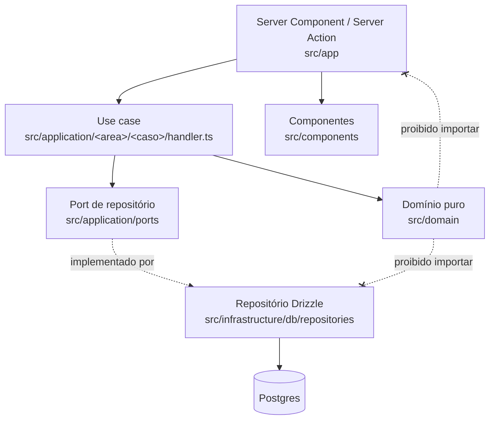

# MVP Gestão Financeira Doméstica — Design

**Spec**: `.specs/features/mvp-gestao-financeira/spec.md`
**Context**: `.specs/features/mvp-gestao-financeira/context.md`
**Status**: Draft

---

## Architecture Overview

Arquitetura em camadas com um núcleo de domínio puro. A tese: **todo o risco deste produto é aritmético** — rateio de centavos, competência versus ciclo de fatura, virada de ano. Essa aritmética mora numa camada sem I/O e sem framework, testada exaustivamente antes de existir banco ou tela.



Regras de fluxo:

- Mutações passam por **Server Actions**; há um único cliente (a própria UI), então uma API REST separada seria contrato duplicado sem consumidor.
- **Route Handlers** existem apenas para `/api/auth/[...nextauth]` e `/api/health`.
- Server Components leem **via caso de uso**, nunca via Drizzle direto na página.
- O domínio **nunca** é chamado pela UI diretamente — sempre através de um caso de uso.

---

## Code Reuse Analysis

### Existing Components to Leverage

Projeto greenfield: não há código a reutilizar dentro do repositório. O que é reutilizado é **padrão arquitetural**, vindo dos projetos .NET do usuário.

| Component | Location | How to Use |
| --- | --- | --- |
| Estrutura Domain / Application / Infrastructure | `~/Documents/portal-servicos-net-hospedagem-eventos-api/Portal.HospedagemEventos/` | Aplicar a mesma separação: `src/domain` ≈ `Domain/Entidades`, `src/application` ≈ `Application/`, `src/infrastructure/db/repositories` ≈ `Infrastructure/Data/Repository` |
| Pasta por caso de uso | `Application/SolicitacaoEvento/InserirHistorico/` | `src/application/compras/criar-compra-parcelada/handler.ts` segue a mesma convenção de um diretório por caso de uso |
| Repositório atrás de interface | `Infrastructure/Data/Repository` | Ports em `src/application/ports`, implementações em `src/infrastructure/db/repositories`, fakes em memória para teste de caso de uso |
| Skill `tlc-spec-driven` | `.claude/skills/tlc-spec-driven/` | Gates determinísticos (`validate_spec`, `validate_tasks`, `check_commit`, `validate_state`) e o Verifier independente |

### Integration Points

| System | Integration Method |
| --- | --- |
| Neon Postgres | Drizzle ORM sobre `DATABASE_URL` com `sslmode=require`; migrations SQL versionadas em `drizzle/` |
| Google OAuth | Auth.js v5, provider único, allowlist de e-mails em `EMAILS_PERMITIDOS` |
| Vercel | Deploy por push; variáveis de ambiente no painel; `drizzle-kit migrate` no build |
| Docker local | `docker-compose.yml` com Postgres para os testes de integração (AD-010) |

---

## Components

### `domain/shared/money`

- **Purpose**: Representar e operar dinheiro como inteiro em centavos, sem perda.
- **Location**: `src/domain/shared/money.ts`
- **Interfaces**:
  - `criarCents(valor: number): Result<Cents, DomainError>` — valida inteiro positivo
  - `somar(a: Cents, b: Cents): Cents`
  - `subtrair(a: Cents, b: Cents): Cents`
  - `multiplicar(a: Cents, quantidade: number): Cents`
  - `parseBRL(entrada: string): Result<Cents, DomainError>` — `"1.234,56"` → `123456`
- **Dependencies**: `result.ts`
- **Reuses**: nada — é primitiva de base

### `domain/shared/competencia`

- **Purpose**: Aritmética de mês/ano sem `Date` e sem fuso implícito (AD-002).
- **Location**: `src/domain/shared/competencia.ts`
- **Interfaces**:
  - `criarCompetencia(texto: string): Result<Competencia, DomainError>` — valida `'YYYY-MM'`
  - `addMeses(c: Competencia, n: number): Competencia` — aceita `n` negativo
  - `compararCompetencias(a: Competencia, b: Competencia): -1 | 0 | 1`
  - `diffMeses(a: Competencia, b: Competencia): number`
  - `rangeCompetencias(de: Competencia, ate: Competencia): Competencia[]`
  - `dataParaCompetencia(dataISO: string, tz: string): Result<Competencia, DomainError>` — fuso **explícito**
- **Dependencies**: `result.ts`
- **Reuses**: nada

### `domain/parcelamento`

- **Purpose**: Resolver a dor central — distribuir parcelas preservando a soma exata.
- **Location**: `src/domain/parcelamento/`
- **Interfaces**:
  - `ratearParcelas(total: Cents, n: number, politica: PoliticaResiduo): Result<Cents[], DomainError>`
  - `gerarParcelas(entrada: EntradaCompra): Result<PlanoParcelamento, DomainError>` — devolve `{ valorTotal, parcelas: [{ numero, valor, competencia }], valorAmortizadoAnterior }`
  - `regenerarParcelas(compra, alteracoes, parcelasPagas): Result<PlanoRegeneracao, DomainError>`
- **Dependencies**: `money.ts`, `competencia.ts`, `result.ts`
- **Reuses**: `ratearParcelas` é reutilizado por `gerarParcelas` e por `regenerarParcelas` — a política de resíduo existe em um único lugar

### `domain/cartao`

- **Purpose**: Ciclo de fatura e regras de meio de pagamento, isolados do eixo competência.
- **Location**: `src/domain/cartao/`
- **Interfaces**:
  - `resolverCicloFatura(cartao: Cartao, dataCompra: string): Result<CicloFatura, DomainError>` — `{ competenciaFatura, cicloInicio, cicloFim, dataVencimento }`
  - `podeReceberNovaCompra(meio: MeioPagamento): Result<void, DomainError>`
  - `diaEfetivo(dia: number, ano: number, mes: number): number` — `min(dia, último dia do mês)`
- **Dependencies**: `competencia.ts`, `result.ts`
- **Reuses**: `diaEfetivo` é compartilhado entre fechamento e vencimento

### `domain/mes` e `domain/orcamento`

- **Purpose**: Agregação mensal e avaliação de orçamento como funções puras sobre listas de lançamentos.
- **Location**: `src/domain/mes/`, `src/domain/orcamento/`
- **Interfaces**:
  - `resumoMensal(lancamentos: Lancamento[]): ResumoMensal` — devolve `{ competenciaView, caixaView }` como objetos separados (MOV-03)
  - `resumoPorCategoria(lancamentos, totalGastos): ResumoCategoria[]`
  - `avaliarOrcamento(gastosPorCategoria, limites, totalOrcado): AvaliacaoOrcamento`
  - `projetarProximosMeses(lancamentosFuturos, n): ComprometimentoFuturo[]`
- **Dependencies**: `money.ts`, `competencia.ts`, `tipos.ts`
- **Reuses**: `resumoPorCategoria` consome o total produzido por `resumoMensal`, garantindo denominador único

### `application/compras/criar-compra-parcelada`

- **Purpose**: Orquestrar validação, cálculo de domínio e persistência transacional.
- **Location**: `src/application/compras/criar-compra-parcelada/handler.ts`
- **Interfaces**:
  - `criarCompraParcelada(entrada: EntradaCriarCompra, deps: { compras: CompraRepository; cadastros: CadastroRepository }): Promise<Result<CompraCriada, DomainError>>`
- **Dependencies**: `domain/parcelamento`, `CompraRepository`, `CadastroRepository`
- **Reuses**: fakes em memória das mesmas ports permitem testar sem banco

### `infrastructure/db/repositories/compra.repository`

- **Purpose**: Persistir compra e suas N parcelas em uma única transação, com assert de conservação antes do commit.
- **Location**: `src/infrastructure/db/repositories/compra.repository.ts`
- **Interfaces**: implementa `CompraRepository` (`salvarComParcelas`, `buscarPorIdempotencyKey`)
- **Dependencies**: Drizzle, schema
- **Reuses**: mapeadores compartilhados entre repositórios (linha do banco → tipo de domínio)

---

## Data Models

Dez tabelas. Definição completa de colunas e restrições no plano aprovado; aqui ficam os contratos do domínio (tipos puros, não linhas do ORM).

```typescript
type Cents = number & { readonly __brand: 'Cents' }
type Competencia = string & { readonly __brand: 'Competencia' } // 'YYYY-MM'

type Natureza = 'RECEITA' | 'DESPESA' | 'INVESTIMENTO'
type Origem = 'AVULSO' | 'PARCELA' | 'RECORRENCIA'
type TipoMeio = 'CONTA_CORRENTE' | 'CARTAO_CREDITO' | 'ROTULO'
type PoliticaResiduo = 'PRIMEIRAS' | 'ULTIMAS'

interface Lancamento {
  readonly id: string
  readonly natureza: Natureza
  readonly origem: Origem
  readonly descricao: string
  readonly competencia: Competencia
  readonly dataEvento: string
  readonly valor: Cents
  readonly valorPrevisto: Cents | null
  readonly pagoEm: string | null          // null = previsto; preenchido = realizado
  readonly categoriaId: string | null
  readonly usuarioId: string
  readonly meioPagamentoId: string
  readonly compraId: string | null
  readonly numeroParcela: number | null
  readonly canceladoEm: string | null
}

interface EntradaCompra {
  readonly modo: 'TOTAL' | 'VALOR_PARCELA'
  readonly valorEntrada: Cents
  readonly qtdParcelas: number            // 1..120
  readonly competenciaCompra: Competencia // competência da parcela 1
  readonly parcelaInicial: number         // 1 por padrão; 8 no caso "8/10"
  readonly politicaResiduo: PoliticaResiduo
}

interface PlanoParcelamento {
  readonly valorTotal: Cents
  readonly parcelas: ReadonlyArray<{ numero: number; valor: Cents; competencia: Competencia }>
  readonly valorAmortizadoAnterior: Cents // soma das parcelas antes de parcelaInicial (AD-005)
}

interface ResumoMensal {                   // três objetos, nunca somados entre si (MOV-03)
  readonly competenciaView: { totalGastos: Cents; fixos: Cents; cartao: Cents; avulsos: Cents; entradas: Cents; investimentos: Cents; pendente: Cents; saldo: Cents }
  readonly caixaView: { saidas: Cents; entradasRecebidas: Cents; investimentosRealizados: Cents; saldo: Cents }
  readonly futuro: ReadonlyArray<{ competencia: Competencia; comprometido: Cents }>
}
```

**Relationships**: `movimento` referencia `compra_parcelada` (`compra_id` + `numero_parcela`, únicos juntos), `recorrencia` + `recorrencia_versao`, `fatura`, `categoria`, `usuario` e `meio_pagamento`. `pagamento_fatura` referencia apenas `fatura` e **não possui** `natureza` nem `categoria_id` — é o que torna a dupla contagem impossível de compilar (AD-003).

---

## Error Handling Strategy

O domínio nunca lança: retorna `Result<T, DomainError>` com `DomainError = { code: CodigoErro; detalhes?: Record<string, unknown> }`. `CodigoErro` é union fechada, sem mensagem — a mensagem em pt-BR vive em `src/lib/erros.ts`, que é apresentação.

| Error Scenario | Handling | User Impact |
| --- | --- | --- |
| Parcela resultaria em R$ 0,00 | `err('PARCELA_INFERIOR_A_UM_CENTAVO')` antes de qualquer escrita | Mensagem no campo de parcelas: "O valor é pequeno demais para esse número de parcelas" |
| Quantidade de parcelas fora de 1..120 | `err('QTD_PARCELAS_INVALIDA')` | Erro no campo, formulário preservado |
| Parcela inicial maior que a quantidade | `err('PARCELA_INICIAL_INVALIDA')` | Erro no campo "já estou na parcela" |
| Compra em meio de pagamento arquivado | `err('MEIO_PAGAMENTO_ARQUIVADO')` | O cartão nem aparece no seletor; o erro é a segunda barreira |
| Falha ao inserir a N-ésima parcela | `ROLLBACK` da transação inteira | Nada é gravado; mensagem de erro com identificador de correlação |
| Assert de conservação falha antes do commit | `ROLLBACK` e erro `CONSERVACAO_VIOLADA` | Nunca deve ocorrer; existe para virar erro imediato em vez de centavo perdido |
| Reenvio do formulário com a mesma chave de idempotência | Retorna a compra existente com sucesso | Usuário vê a compra criada uma vez, sem duplicata e sem mensagem de conflito |
| Competência inválida na URL | `notFound()` do Next | Página de não encontrado |
| Validação Zod falha na Server Action | `code: 'VALIDACAO'` com mapa de campos | Erros aplicados campo a campo pelo react-hook-form |
| Sessão ausente ou e-mail fora da allowlist | Redirect para `/login`, ou 403 sem criar usuário | Tela de login com mensagem de acesso não autorizado |
| Variável de ambiente obrigatória ausente | Processo encerra no boot | Deploy falha de forma barulhenta, em vez de `undefined` silencioso em runtime |
| Erro inesperado | `code: 'ERRO_INESPERADO'` com `correlationId` curto, logado no servidor | Mensagem genérica; **stack trace nunca chega ao navegador** |
| Banco indisponível | Única exceção que sobe, capturada na borda | Estado de erro com opção de tentar novamente |

Contrato uniforme de toda Server Action, que **nunca lança para o cliente**:

```typescript
type ResultadoAction<T> =
  | { ok: true; data: T }
  | { ok: false; erro: { code: string; mensagem: string; campos?: Record<string, string> } }
```

---

## Risks & Concerns

| Concern | Location | Impact | Mitigation |
| --- | --- | --- | --- |
| Erosão silenciosa da fronteira do domínio: um `import` de framework entra e a pureza se perde sem ninguém notar | `src/domain/**` | Os testes puros deixam de rodar em milissegundos; o núcleo passa a exigir mocks | Teste de fronteira (`arquitetura.test.ts`) que lê os imports de todos os arquivos da camada e falha; mais `noRestrictedImports` no Biome. Fase 0, task 0.6 |
| Perda de centavo no rateio passar despercebida por teste de exemplo | `src/domain/parcelamento/ratear-parcelas.ts` | Corrompe silenciosamente o total de qualquer compra não divisível — a dor central do projeto | Teste de propriedade com fast-check sobre toda combinação de valor e quantidade; mais assert de conservação antes do commit da transação; mais mutante obrigatório no Verifier (AD-011) |
| Duplicação da lógica de agregação entre SQL e função pura quando o dashboard chegar | `src/infrastructure/db/repositories` vs `src/domain/mes` | Dois cálculos divergem e o usuário vê números diferentes em telas diferentes | Fora desta feature (Fase 8), mas já registrado: quando a consulta agregada existir, um teste de concordância deve provar que SQL e função pura produzem valores idênticos para o mesmo conjunto |
| Fixture ou seed vazar valores reais da família para o git | `src/infrastructure/db/seed.ts`, `src/**/*.test.ts`, `e2e/` | Irreversível: reescrever histórico não desfaz clones | AD-009 registrado no `STATE.md` e no `AGENTS.md` do projeto; seed determinístico com nomes genéricos; item explícito nos Success Criteria do spec |
| Testes de integração exigirem Docker quebram o gate em ambiente sem contêiner | `vitest.config.ts`, CI | Gate `full` falha por motivo ambiental, não por regressão | Script `db:up` no `package.json`; `services: postgres` no CI; projects do Vitest separados para que o gate `quick` nunca dependa de banco |
| Contexto do agente estourar com 47 tasks em uma feature | execução | Degradação de qualidade nas fases finais | Sub-agentes por batch de fases inteiras, sequenciais, conforme `sub-agents.md`; nenhuma fase dividida entre workers |

---

## Tech Decisions (only non-obvious ones)

Decisões de nível de projeto estão em `.specs/STATE.md` como AD-001 a AD-011. A tabela abaixo registra apenas o que é local desta feature.

| Decision | Choice | Rationale |
| --- | --- | --- |
| Modo de entrada da compra | Aceitar **valor total** ou **valor da parcela**, com enum `modo_entrada` | No fluxo real o usuário quase sempre digita o valor da parcela ("60,00, é a 8 de 10"). Nesse modo o total é `parcela × n`, exato, sem resíduo — o rateio só é exercitado no modo total, o que reduz a superfície de risco na prática |
| Preview das parcelas no formulário | Calculado no cliente pela **mesma função pura** do domínio, antes de submeter | O usuário confere as competências e o centavo residual antes de gravar. Reusar a função elimina a chance de preview e persistência divergirem |
| Chave de idempotência | Gerada no cliente ao **abrir** o formulário, não ao submeter | Gerar no submit não protege contra duplo-clique, que é o caso real. Colisão devolve 200 com o recurso existente, de modo que o retry seja observacionalmente idêntico ao sucesso |
| Ordem das fases | Núcleo puro (1 a 3) **antes** de banco (4) e UI (5 e 6) | Todo o risco financeiro fica coberto por testes que rodam em ~200 ms antes de existir qualquer plumbing. Inverter a ordem faria a aritmética ser validada por e2e lento |
| Estrutura do `resumoMensal` | Três objetos aninhados (`competenciaView`, `caixaView`, `futuro`) em vez de campos irmãos | Somar competência com caixa passa a exigir código que atravessa a fronteira de objeto, o que aparece em code review. É a divergência de R$ 1.200,00 virando estrutura de tipo em vez de comentário |
