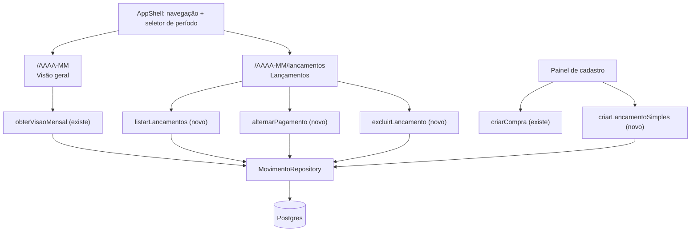

# Painel e Lançamentos (fatia 1): Design

**Spec**: `.specs/features/painel-e-lancamentos/spec.md`
**Referência visual**: `docs/design.md` (normativo), derivado do documento fornecido pelo usuário
**Status**: Draft

---

## Architecture Overview

A fatia não inventa arquitetura: estende a que existe. O núcleo de domínio está fechado e não é tocado. O que falta é a camada entre ele e a tela.



**A competência vive na rota**, não em estado global. `/2026-03` é a Visão geral daquele mês; `/2026-03/lancamentos` é a lista. Trocar de área é um link, não uma sincronização, e abrir em nova aba funciona. As rotas que o e2e já usa continuam válidas.

---

## Code Reuse Analysis

### Existing Components to Leverage

| Component | Location | How to Use |
| --- | --- | --- |
| Tokens de cor, raio e sombra | `src/app/globals.css` | Base de tudo. Muda apenas a escada do tema escuro |
| `Botao`, `Chip`, `Painel` | `src/components/ui.tsx` | Primitivas já alinhadas à escala de raios |
| `formatarBRL`, `formatarData`, `formatarCompetencia` | `src/lib/formatar.ts` | Única fronteira onde centavos viram texto |
| `SeletorCompetencia` | `src/components/seletor-competencia.tsx` | Evolui para `SeletorPeriodo` com "Mês atual" e sobe para o shell |
| `FormCompra` | `src/components/form-compra.tsx` | Move para dentro do painel de cadastro, sem reescrever a lógica de prévia e idempotência |
| `TabelaLancamentos` | `src/components/tabela-lancamentos.tsx` | Evolui: densidade menor, coluna de ações, estado vencido |
| `TransicaoMes` | `src/components/transicao-mes.tsx` | Reaproveitado no painel |
| `obterVisaoMensal` | `src/application/mes/obter-visao-mensal/handler.ts` | Alimenta os quatro indicadores sem alteração |
| `resumoMensal`, `resumoPorCategoria` | `src/domain` | Já calculam os dois eixos. Nada de matemática nova |
| `criarCompra` | `src/app/actions/compras.ts` | Reaproveitada pelo painel de cadastro |
| `marcarPagamento` | `MovimentoRepository` | Existe no repositório; falta caso de uso e action |

### Integration Points

| System | Integration Method |
| --- | --- |
| Auth | `sessaoDaUI` no layout e `requireSession` na primeira instrução de toda action nova |
| Postgres | Métodos novos no `MovimentoRepository` existente, sem repositório novo |
| Domínio | Consumido pelo barrel `@/domain`. Nenhuma função nova de domínio nesta fatia |

---

## Components

### `AppShell`

- **Purpose**: Moldura de todas as áreas autenticadas: navegação, seletor de período, ação de cadastro.
- **Location**: `src/app/(app)/[competencia]/layout.tsx`
- **Interfaces**: recebe `competencia` do segmento de rota e `children`.
- **Dependencies**: `SeletorPeriodo`, `NavegacaoPrincipal`, `sessaoDaUI`
- **Reuses**: o pill flutuante e os tokens que já existem

### `NavegacaoPrincipal`

- **Purpose**: Lista as áreas implementadas e marca a ativa.
- **Location**: `src/components/navegacao-principal.tsx`
- **Interfaces**: `{ competencia, areaAtiva }`
- **Comportamento**: barra lateral a partir de 768px, barra inferior abaixo disso. A área ativa é marcada por peso tipográfico e um indicador de forma, nunca só por cor (NAV-03).
- **Regra**: a lista de áreas é uma constante; área não implementada não entra nela.

### `SeletorPeriodo`

- **Purpose**: Anterior, próximo, mês, ano e "Mês atual".
- **Location**: `src/components/seletor-periodo.tsx`
- **Reuses**: `SeletorCompetencia`, acrescentando "Mês atual" e preservando a área ao navegar.
- **Detalhe**: a data corrente é lida no cliente. O servidor não sabe o fuso do navegador, e "mês atual" calculado no servidor erraria na virada do mês para quem estiver em fuso diferente.

### `AlternadorDeVisao`

- **Purpose**: Trocar entre Planejamento e Movimentações.
- **Location**: `src/components/alternador-de-visao.tsx`
- **Interfaces**: `{ visao: 'planejamento' | 'movimentacoes', aoTrocar }`
- **Semântica**: `role="radiogroup"` com dois `radio`. Não são abas: abas trocam conteúdo, isto troca a **lente** sobre o mesmo conteúdo.
- **Por que existe**: é o que permite quatro indicadores em vez de oito e elimina "eixo competência" da tela sem perder a distinção (DASH-02, DASH-03).

### `Indicador`

- **Purpose**: Um dos quatro números do painel, clicável.
- **Location**: `src/components/indicador.tsx`
- **Interfaces**: `{ rotulo, valor, destino, enfase? }`
- **Comportamento**: é um link para `/AAAA-MM/lancamentos` com o filtro na query. Link e não botão: o navegador dá foco, teclado e abrir em nova aba de graça.

### `PainelDeCadastro`

- **Purpose**: Abriga os três tipos de cadastro fora do fluxo de consulta.
- **Location**: `src/components/painel-de-cadastro.tsx`
- **Interfaces**: `{ competencia, meios, categorias, usuarios, aberto, aoFechar }`
- **Comportamento**: `<dialog>` nativo. Foco vai para o primeiro campo ao abrir e volta ao gatilho ao fechar; `Esc` fecha; foco fica preso dentro enquanto aberto. Em telas estreitas ocupa a altura inteira.
- **Guarda**: fechar com campo preenchido pede confirmação (CAD-04).

### `FormLancamentoSimples`

- **Purpose**: Despesa à vista e receita. Mesmo formulário, natureza diferente.
- **Location**: `src/components/form-lancamento-simples.tsx`
- **Interfaces**: `{ natureza: 'DESPESA' | 'RECEITA', competencia, ... , enviar }`
- **Reuses**: o padrão de idempotência e tratamento de erro do `FormCompra`

### `FiltrosDeLancamentos`

- **Purpose**: Busca e filtros, com estado na URL.
- **Location**: `src/components/filtros-de-lancamentos.tsx`
- **Decisão**: o estado dos filtros vive em query string, não em `useState`. Isso torna o filtro compartilhável por link, sobrevive ao recarregar, e é o que permite o indicador do painel abrir a lista já filtrada (DASH-04).

---

## Data Models

Nenhuma tabela nova. Nenhum campo novo. O que muda é o que a camada de acesso sabe perguntar.

```typescript
/** Filtros aceitos pela listagem. Todos opcionais; ausência significa "não filtrar". */
interface FiltroDeLancamentos {
  readonly competencia: Competencia
  readonly busca?: string
  readonly categoriaId?: string
  readonly meioPagamentoId?: string
  readonly usuarioId?: string
  readonly situacao?: "PENDENTE" | "PAGO" | "VENCIDO"
  readonly natureza?: Natureza
  readonly origem?: Origem
}

/** Entrada de despesa à vista ou receita. Uma parcela, competência do mês aberto. */
interface EntradaLancamentoSimples {
  readonly idempotencyKey: string
  readonly natureza: "DESPESA" | "RECEITA"
  readonly descricao: string
  readonly valorCentavos: Cents
  readonly competencia: Competencia
  readonly dataEvento: string
  readonly categoriaId: string | null
  readonly usuarioId: string
  readonly meioPagamentoId: string
}
```

**Relationships**: `EntradaLancamentoSimples` grava uma linha em `movimento` com `origem = 'AVULSO'`. A restrição `CHECK ((origem='PARCELA') = (compra_id IS NOT NULL ...))` do schema já garante que um avulso não carregue vínculo de compra.

**Situação é derivada, não armazenada.** `PAGO` quando `pagoEm` está preenchido; `VENCIDO` quando está vazio e a competência é anterior à corrente; `PENDENTE` nos demais casos. Guardar situação em coluna criaria um estado que precisa ser mantido em dia com o calendário.

---

## Error Handling Strategy

| Error Scenario | Handling | User Impact |
| --- | --- | --- |
| Valor monetário inválido no cadastro | `VALOR_NAO_POSITIVO` do domínio, mapeado ao campo | Mensagem sob o campo, preenchimento preservado |
| Descrição vazia | Zod, mapeado ao campo | Mensagem sob o campo |
| Reenvio com a mesma chave de idempotência | Retorna o lançamento existente | Sucesso, sem duplicata e sem mensagem de conflito |
| Tentativa de excluir parcela de compra | Action recusa com `EXCLUSAO_NAO_PERMITIDA` | O controle nem é oferecido; a recusa é a segunda barreira |
| Competência malformada na rota | `notFound()` | Página de não encontrado |
| Filtro sem resultado | Não é erro | Estado vazio que distingue "mês sem lançamento" de "nenhum resultado para este filtro" (LANC-03) |
| Falha de leitura | `error.tsx` da rota, com identificador de correlação | Sem mensagem técnica nem rastro de pilha |
| Sessão ausente em action | `requireSession` na primeira instrução | Redirecionamento para login |

---

## Risks & Concerns

| Concern | Location | Impact | Mitigation |
| --- | --- | --- | --- |
| A reconciliação entre indicador e lista pode divergir se o filtro do link não corresponder exatamente ao predicado do indicador | `Indicador` e `listarLancamentos` | O painel promete uma soma que a lista não confirma, e o usuário perde confiança nos números | Indicador e filtro derivam do **mesmo** predicado, exportado de um único módulo. Um teste de integração compara o valor do indicador com a soma da lista filtrada, para os quatro |
| Situação derivada depende da data corrente, que difere entre servidor e navegador | Cálculo de `VENCIDO` | Um lançamento aparece vencido num lado e pendente no outro | A competência corrente é resolvida uma vez, no servidor, e desce como prop. O cliente não recalcula |
| `<dialog>` nativo tem comportamento de foco irregular entre navegadores | `PainelDeCadastro` | Armadilha de foco falha e o teclado escapa do modal | Teste e2e que percorre o modal apenas por `Tab` e confirma que o foco não sai |
| Filtro em query string pode crescer e virar URL ilegível | `FiltrosDeLancamentos` | Link compartilhado fica feio, mas funciona | Aceito. Chaves curtas e omissão de parâmetro vazio |
| A escada nova do tema escuro pode piorar algo que hoje está bom | `globals.css` | Regressão visual silenciosa | Os degraus foram medidos antes: 1.145 e 1.224, contra 1.104 e 1.101 do atual. Texto a 14.74:1 e acento a 7.16:1 sobre a superfície nova |
| Densidade menor na tabela pode reduzir a área de toque | `TabelaLancamentos` | Toque impreciso no celular | A linha encolhe no desktop; no celular continua cartão. Controles interativos mantêm 44 por 44 independentemente (UX-03) |

---

## Tech Decisions (only non-obvious ones)

| Decision | Choice | Rationale |
| --- | --- | --- |
| Onde vive a competência | Segmento de rota | Estado global exigiria sincronizar duas áreas e quebraria nova aba. A rota já tinha esse formato |
| Onde vive o estado dos filtros | Query string | É o que torna o filtro compartilhável e o que permite o indicador do painel abrir a lista já filtrada |
| Alternador em vez de dois blocos | `radiogroup` de duas posições | Quatro indicadores em vez de oito, jargão fora da tela, e `MOV-03` preservado por construção: com uma visão por vez, não existe composição que some os dois eixos |
| Situação derivada, não armazenada | Calculada na leitura | Coluna de situação precisaria de um processo que a mantenha em dia com o calendário, e ficaria errada em todo lançamento que vence sem ninguém abrir o app |
| `<dialog>` nativo em vez de biblioteca de modal | Elemento nativo | Traz camada superior, `Esc` e semântica de diálogo sem dependência. O que falta, armadilha de foco consistente, custa menos que uma biblioteca |
| Densidade da tabela | Linha de `py-2.5` no desktop, cartão no celular | O documento de referência é de página institucional e prevê respiro alto. Tabela financeira precisa de comparação rápida. Mantenho raio e sombra do contêiner e aperto só o interior |
| Sem biblioteca de tabela | HTML semântico | Ordenação e filtro desta fatia são simples. TanStack Table entraria para resolver problema que ainda não existe |
